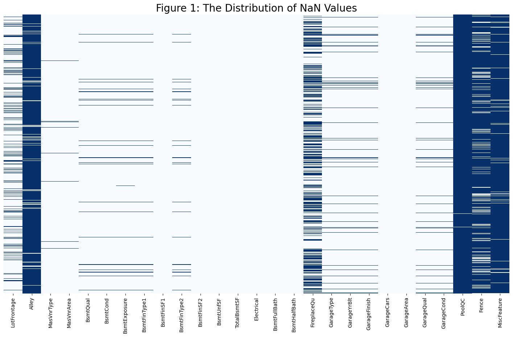
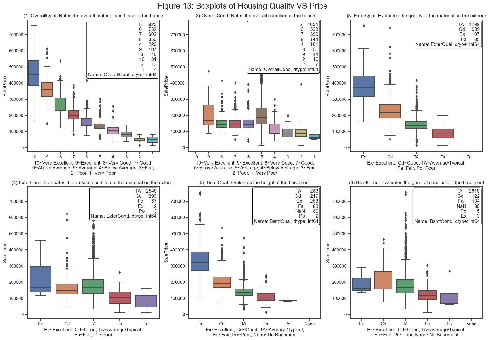
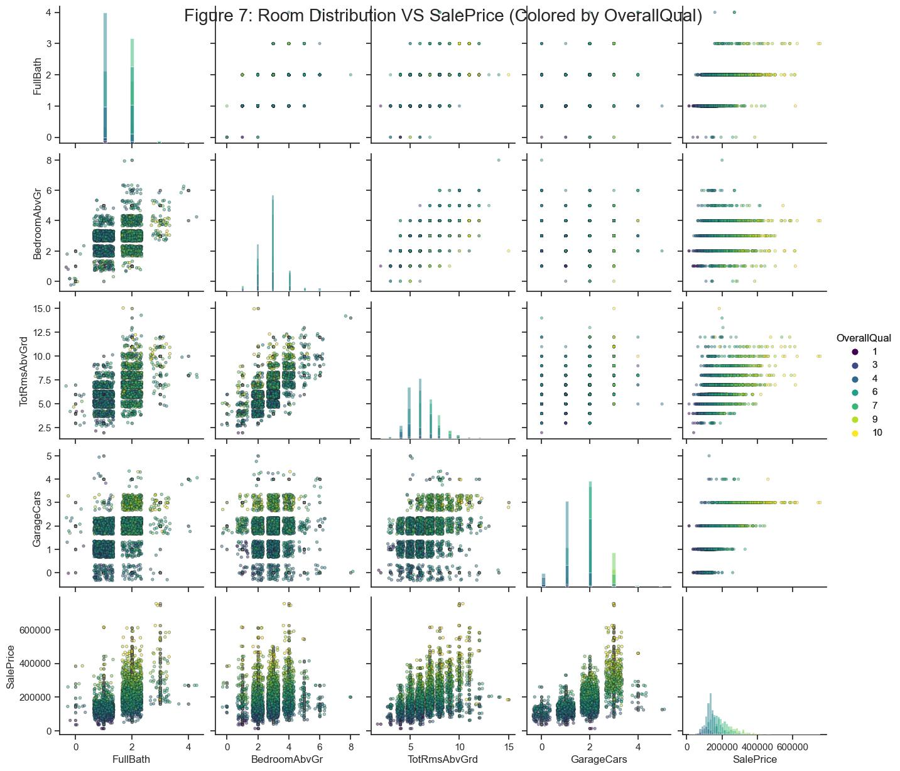
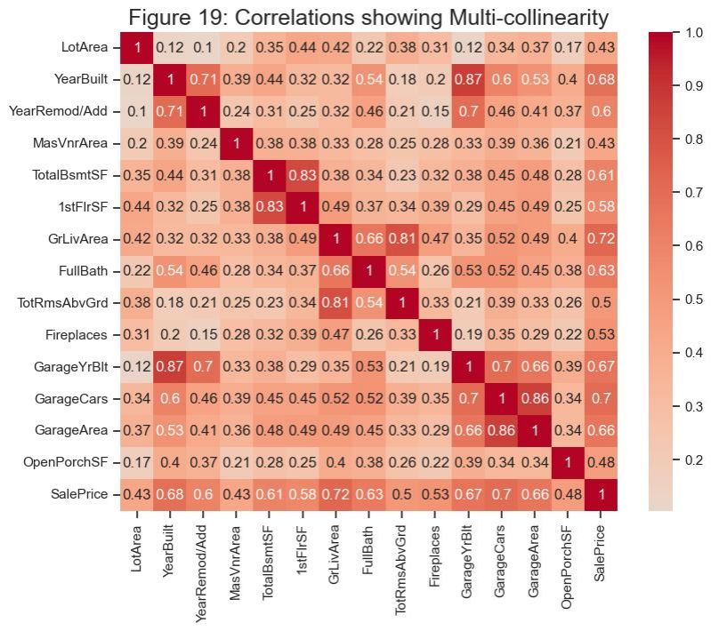
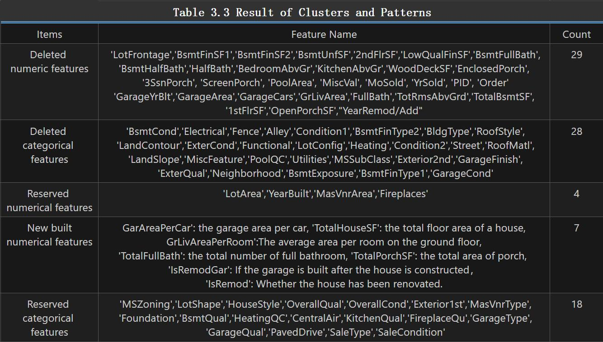
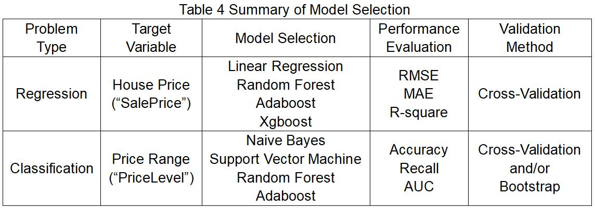
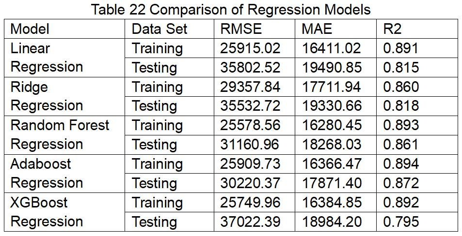
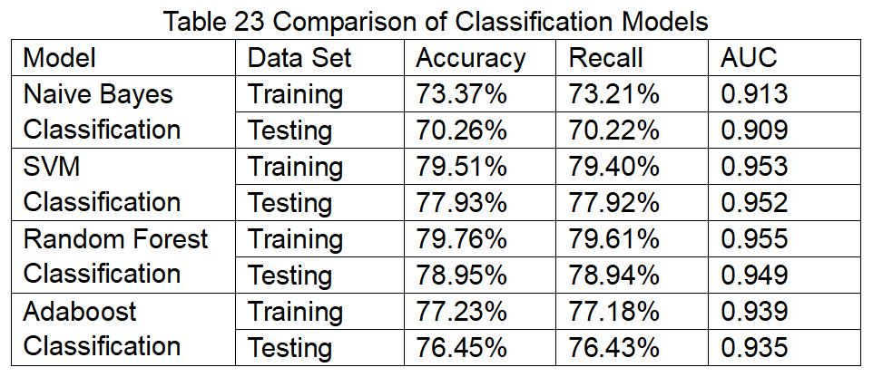
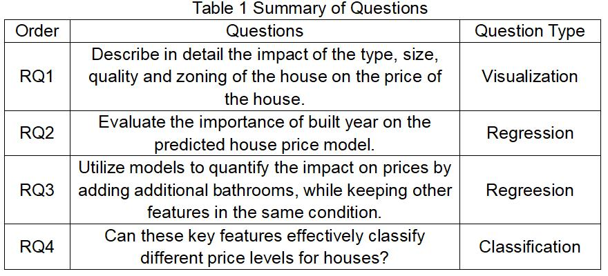

# Project Overview

Real estate market plays a significant role in the economic field. Congressional Research Service (2023) has reported that in the United States of 2021, the volume on property investment and services stood at approximately $3.9 trillion, constituting around 16.7% of GDP. Therefore, it’s crucial for investors to gain a profound insight of the house price trends. This project aims to analyze and evaluate the impact of attributes of a house on the price of the house. Build appropriate models to predict housing prices.

## Part A

1. Project Feasibility Analysis
2. Data Collection
3. Data Description
4. Research Questions(Regression and Classification)
5. Research Plan

## Part B

1. Data Pre-processing
2. Exploratory Data Analysis
3. Feature Engineering
4. Questions Refinement

## Part C

### Build, Evaluate and Compare Models

## Part D

### Answer below questions based on established models and give conclusions

